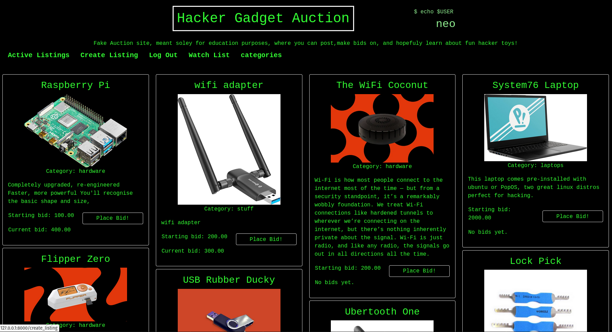

# hack_bay
Meant soley for educational purposes , an eBay-like e-commerce auction site that will allow users to post auction listings about hacker gadgets, place bids on listings, comment on those listings, and add listings to a “watchlist.”

Built an eBay-inspired e-commerce auction site for hacker gadgets (e.g., Raspberry Pi, RubberDucky). This web application is developed with the Django Web framework and SQLite, featuring auction listings, bidding, commenting, and a 'watchlist'. The application security measures include Django's built-in protection against CSRF and SQL Injection attacks, hashed and salted passwords for user authentication, and input sanitization to prevent XSS attacks.

Check out what the frontend looks like!

# Coming Soon
So i am in the process of hosting this website myself via NGINX on an EC2 instance. I already purchached the domain HackBay.net. This is mainly for fun and to gain practical experience with cloud deployment, setting up HTTPS, and properly configuring web servers and permissions.
